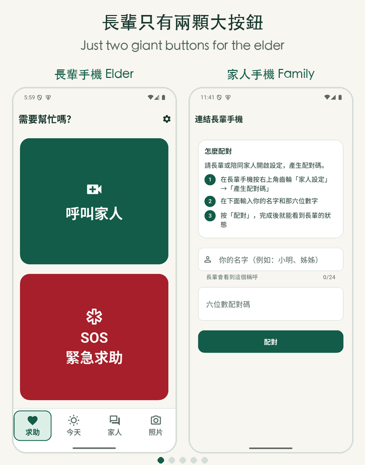
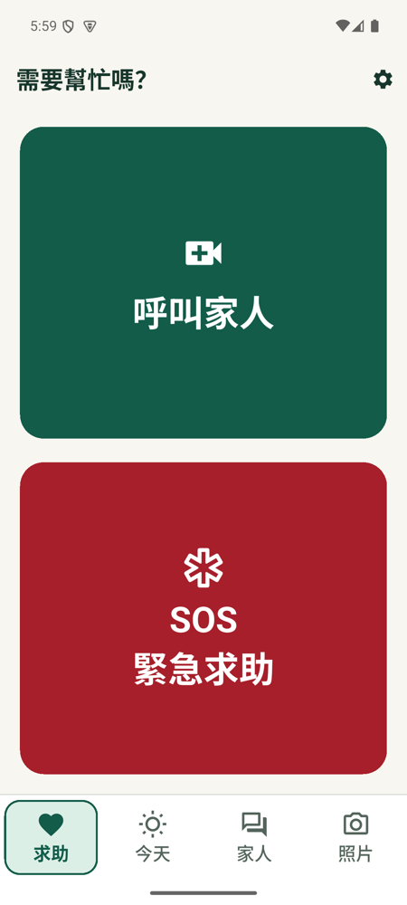
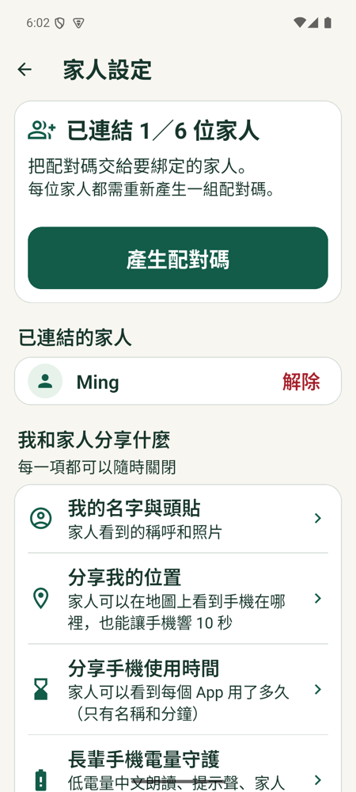
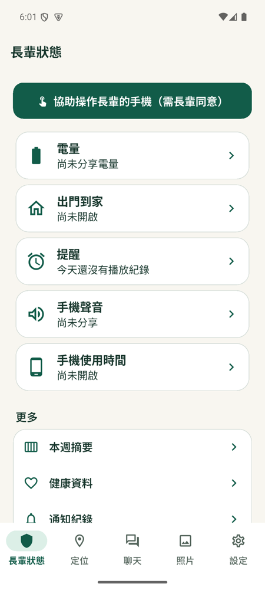
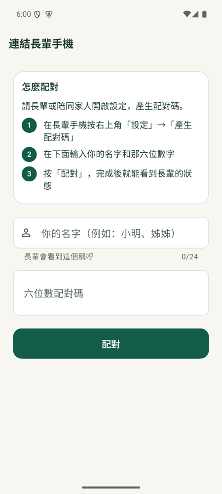

# FamilyHelper

**English** | [繁體中文](README.zh-TW.md)

**Help your elderly family members with their Android phones — remotely, and only with their permission.**

The elder's phone shows just two huge buttons: **"Call family"** and **"SOS"**. Family members can see the elder's screen from their own phones, tap and swipe to help, and video-chat. **Every single session must be approved by the elder on their own phone**, and they can stop it at any time.

> Android only. Each family runs its own Firebase backend — no data is shared with anyone else.

<p align="center"></p>

<p align="center"><em>Demo: pairing → the elder approves → Android confirms screen sharing. The consent screen blocks screenshots for safety, so frame 4 is an illustration.</em></p>

| Elder: home | Elder: settings | Family: home | Family: pairing |
| --- | --- | --- | --- |
|  |  |  |  |

---

## Why I built this

My grandmother lives alone. Whenever her phone gets a notification, all she hears is a generic system chime — she has no idea which app it came from or who sent it. Unless someone calls her directly, she rarely replies to messages in time, and important notifications often slip by unnoticed.

What elderly people living alone miss most is company. So I built FamilyHelper:

- Messages and voice notes from the family are **read aloud and played automatically** — much warmer than a beep.
- The screen is simple enough that my grandmother can **take and share photos on her own**, so the whole family can see how she's doing every day, even when we're far away.
- When she needs help, one big button reaches the family, and with her permission, we can help her remotely.

Building it has also brought our family closer together.

I vibe-coded this during dinner breaks, so parts of it are still a bit rough 😂 — but the feature design went through a full day of real-world use and many rounds of fixes.

### Tell me what your elders need

**Does an elderly person in your life have a need that software could help with?** Open a [💡 Share an elder's need](../../issues/new?template=elder_need.yml) issue or start a thread in [Discussions](../../discussions). You bring the idea, I'll build it — and next time it won't be just vibe coding 😄

Feedback from anywhere in the world is welcome.

---

## Features

| Elder app (on the elder's phone) | Family app (up to 6 phones) |
| --- | --- |
| Two huge buttons: Call family, SOS (with location) | Push alert for calls and SOS, one-tap answer |
| Local approval for every session, stop anytime | View the elder's screen, tap and swipe remotely, video chat |
| Messages and voice notes read aloud, daily quote | Elder status: battery, last seen, alert history |
| One-tap photo sharing with family | Photo wall, save to your gallery |
| Spoken reminders (medicine, water…), screen-break reminders | Set up reminders and the morning weather read-out |
| Spoken low-battery warnings | Low-battery alerts, shows who's handling it |
| Optional: location, screen time, leave/arrive home, health data | Map view, make the elder's phone ring |
| Home-screen widgets: Call / SOS | — |

Everything shared with the family is **off by default**. The elder turns each item on from their own phone and can pause it at any time.

## Privacy and safety

- **Consent every time**: each session needs the elder's approval on their phone, followed by Android's own screen-sharing prompt. Declining, locking the screen, stopping the share or losing the connection ends remote control immediately.
- **System screens can't be tapped remotely**: Settings, permission dialogs, the package installer and FamilyHelper itself block remote gestures.
- **No recording, no uploads**: screen and audio go peer-to-peer over WebRTC and are never stored in the database.
- **No accounts or passwords**: just a 6-digit pairing code and an anonymous identity. All pairing, consent and session locks are enforced by the backend.
- **Your data stays in your own Firebase**: every family creates its own project. Note that the owner of that Firebase project (you) can see what's in the database.

Full design: [docs/ARCHITECTURE.md](docs/ARCHITECTURE.md) (Chinese).

## Getting started

You'll need a computer (Mac, Windows or Linux) to set up the backend and build the apps. **No coding required** — the setup wizard walks you through it in about 30–60 minutes.

1. **Install the tools**: Flutter, JDK 17, Node.js 22, Python 3 ([guide](docs/SETUP.md#1-安裝工具))
2. **Download the project and run the setup wizard**

   ```bash
   git clone https://github.com/cyc083/FamilyHelper.git
   cd FamilyHelper
   python3 tool/setup.py      # Windows: python tool/setup.py
   ```

   The wizard signs you in to Google → creates a Firebase project → enables the required services → deploys the backend → generates a signing key → builds both APKs. If it stops halfway, just run it again and it picks up where it left off.

3. **Install on the phones**: put `dist/familyhelper-host.apk` on the elder's phone and `dist/familyhelper-client.apk` on each family member's phone, then link them with a pairing code.

Step-by-step guide and FAQ: **[docs/SETUP.md](docs/SETUP.md)** (Chinese; the wizard itself is also in Chinese for now — English translations are welcome!).

## Cost

Firebase Cloud Functions require the **Blaze (pay-as-you-go) plan** with a payment method on file. One family's usage is usually very small, but actual cost depends on Google's pricing and your usage, so **this project can't promise it will be free**. Setting a budget alert in Google Cloud is recommended.

Cross-network connections can optionally use Cloudflare TURN, billed by Cloudflare.

## Limitations

- **Android 8 or later only.** iOS doesn't allow one app to operate other apps, so remote tapping can't work on an iPhone.
- **The apps are sideloaded APKs**; they are not in any app store.
- Without TURN, screen sharing may fail when the elder and the family are on different networks (e.g. Wi‑Fi vs. mobile data).
- SOS only notifies family. **It is not connected to emergency services.** Alerts may not arrive if a phone is off, offline or has notifications disabled.
- Health data is a synced record, **not medical monitoring**.
- Daily reminders and the backend region are set to Taiwan time; see the [known limitations](docs/ARCHITECTURE.md#已知限制).

## For developers

```bash
flutter pub get
flutter analyze
flutter test
npm ci --prefix backend/functions && npm test --prefix backend/functions
python3 -m unittest discover -s tool/tests -p 'test_*.py'

# Needs config/*.json (generated by tool/setup.py) to reach a backend
flutter run --flavor host   -t lib/main_host.dart   --dart-define-from-file=config/host.json
flutter run --flavor client -t lib/main_client.dart --dart-define-from-file=config/client.json
```

- Toolchain: Flutter 3.35.7, JDK 17 (JDK 21 for Firebase emulators), Node.js 22, Android SDK 36
- Architecture and security: [docs/ARCHITECTURE.md](docs/ARCHITECTURE.md)
- Testing: [docs/TESTING.md](docs/TESTING.md)
- Contributing: [CONTRIBUTING.md](CONTRIBUTING.md)
- Security reports: [SECURITY.md](SECURITY.md)

## License

**© 2026 cyc (original author)**

Licensed under [PolyForm Noncommercial 1.0.0](https://polyformproject.org/licenses/noncommercial/1.0.0) with additional terms — see [LICENSE](LICENSE).

- ✅ Download, build and use it for your own family
- ✅ Modify it, restyle it, add features, and share your changes non-commercially (keep the original author credit)
- ❌ **No publishing to any app store** (Google Play, Apple App Store, OEM stores, third-party APK sites…) without written permission
- ❌ No commercial use or resale

This is a source-available license, not an OSI-approved open-source license. Third-party components keep their own licenses; see [THIRD_PARTY_NOTICES.md](THIRD_PARTY_NOTICES.md).

**Want to partner on an official store release or a commercial collaboration?** Email **ychen9086@gmail.com** — I'd be happy to talk.
